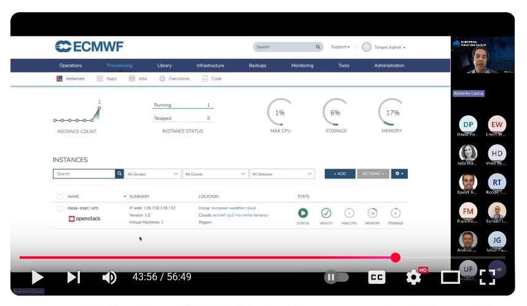

# IPA Client Enroll Automation via Morpheus
>⚠️ In the past this functionality has been provided out-of-the-box for all 
EWC tenancies running on the EUMETSAT site. However, this is no longer the
case; after October 2025, EWC tenant admins wishing to integrate IPA enrollment
with Morpheus VM provisioning can use this template to enable said functionality
for newly onboarded tenancies, on both EUMETSAT or ECMWF sites.

[IPA (identity, policy and audit)](https://www.freeipa.org/) is a software stack that serves both as an LDAP user
management system and as your internal DNS nameserver.

[Morpheus UI](https://docs.morpheusdata.com/en/7.0.9),
on the other hand, is a web-based cloud orchestration tool that lets you manage
your EWC resources via a graphical interface. It has built-in 
[Automation](https://docs.morpheusdata.com/en/7.0.9/library/automation/automation.html)
features you may use for arranging sets of individual Tasks and accomplishing
some useful behavior, executed on a one-off basis or recurrently, when
managing with cloud resources via Morpheus.

This configuration template
(i.e. an [Ansible Playbook](https://docs.ansible.com/ansible/latest/playbook_guide/playbooks.html))
customizes your environment in the
[European Weather Cloud (EWC)](https://europeanweather.cloud/), such that it
crates a Morpheus Automation to simplify the administration of a fleet of IPA-aware EWC compute instances.

## Functionality
> 💡 To provision and configure a VM as an IPA server from scratch and with
fully-managed state (i.e. safe for resizing or upgrading), 
you may deploy the [IPA Server Provisioning](https://europeanweather.cloud/community-hub/ipa-server-provisioning)
Community Hub Item.

> 💡 To configure an existing VM as an IPA server,
you can deploy the [IPA Server Flavour](https://europeanweather.cloud/community-hub/ipa-server-flavour)
Community Hub Item.

Once an IPA server is successfully provisioned
and configured within your EWC environment, this template reduces the remaining 
configuration to a one-time setup for Morpheus such that:
* New VMs created via the Morpheus UI, within
a user-defined Morpheus Network Domain, will enroll onto an IPA server's
provided DNS and LDAP services, enabling users to log into any VM with 
the same username and password.
* Enrolled VMs will disenroll from the IPA server upon
their deletion via Morpheus UI, to ensure a clean and healthy internal DNS
table.


## Copyright and License
Copyright © EUMETSAT 2025.

The provided code and instructions are licensed under the [MIT license](./LICENSE).
They are intended to automate the setup of an environment that includes 
third-party software components.
The usage and distribution terms of the resulting environment are 
subject to the individual licenses of those third-party libraries.

Users are responsible for reviewing and complying with the licenses of
all third-party components included in the environment.

Contact [EUMETSAT](http://www.eumetsat.int) for details on the usage and distribution terms.

## Authentication

Before proceeding, if you lack a Morpheus API access token, make sure
to check out the [Morpheus documentation](https://docs.morpheusdata.com/en/7.0.9/administration/user_settings/user_settings.html#api-access)
for steps on how to generate one on a self-service manner.

## Prerequisites
>💡 Versions listed correspond to minimal prerequisites.

To successfully run this playbook, the following packages should be available in your work environment:

| Name | Version | License | Home URL |
|------|---------|----- |-----|
| git | 2.0 | GPLv2  | https://git-scm.com/downloads |
| python | 3.9   | PSF | https://www.python.org/downloads  |
| ansible | 2.15 |  GPLv3+ | https://pypi.org/project/ansible  |
| jmespath| 1.0 | MIT | https://pypi.org/project/jmespath  |

## Usage

### 1. Configure and apply the template

#### 1.1. Interactive Mode

By running the following command, you can trigger an interactive session that
prompts you for the necessary user inputs, and then applies changes to your
target EWC environment:
```bash
ansible-playbook ipa-enroll-automation.yml
```

#### 1.2. Non-Interactive Mode

>💡 To learn more about defining variables at runtime, checkout the
[official Ansible documentation](https://docs.ansible.com/ansible/latest/playbook_guide/playbooks_variables.html).

You can also run in non-interactive mode by passing the `--extra-vars` or `-e` flag, followed by a map of key-value pairs; one for each and every available input (see [inputs](#inputs) section below). For example:
```bash
ansible-playbook \
  -e '{ "morpheus_api_token":"<api-token>",
        "morpheus_api_url":"https://morpheus.ecmwf.int",
        "morpheus_tenant_name":"<memberstate>-<organization>-<projectname>",
        "update_morpheus_cypher":"yes",
        "morpheus_cypher_ipa_domain":"<memberstate>-<organization>-<projectname>.ewc",
        "morpheus_cypher_ipa_server_hostname":"ipa-server-1",
        "morpheus_cypher_ipa_admin_username":"ipa-admin",
        "morpheus_cypher_ipa_admin_password":"<password>"
  }' \
  ipa-enroll-automation.yml
```

### 2. Manually link the Morpheus Workflow to the user-defined Morpheus Domain
> ⚠️ As of 17.07.2025, technical limitations on the side of the
[Morpheus API](https://apidocs.morpheusdata.com/v7.0.9/reference/createnetworkdomain)
lead to unreliable configuration of links between workflows and domains.
As a workaround, manual action over the Morpheus UI is required.

> ⛔ This step must be performed every time you update the template input values and
apply them.

Finalize the configuration over the Morpheus UI:

1. Login to the Morpheus UI of your EWC environment
2. From the top navigation bar, go to `Infrastructure > Network`.
3. Select `Domains` from the sub navigation bar.
4. A table will be displayed in the lower portion of the view port, and
containing details of available domains in your EWC environment. Click on the
edit icon (`🖉`) on the same row where your defined domain is listed.
5. Within the pop-up edit form, click on the `Select Workflow` drop-down
menu and select `IPA Client Enroll Automation Via Morpheus`.
6. Click on `SAVE CHANGES` at the
bottom of the form to finalize the setup.

### 3. (Optional) Further integrate your IPA Server with Morpheus Monitoring

VMs provisioned via Morpheus UI, such as the ones you may have created 
before applying this template or those you'll create afterwards (which
will automatically become part of your IPA-managed fleet), are equipped with a 
[Morpheus Agent](https://docs.morpheusdata.com/en/7.0.9/getting_started/functionality/agent/overview.html),
a daemon that provide statistics for the guest operating system and resource utilization, 
to enable monitoring and log aggregations.

If you are fond of such Morpheus monitoring functionality, note
that you can turn instances provisioned via Community Hub Item templating
(i.e. [IPA Server Provisioning](https://europeanweather.cloud/community-hub/ipa-server-provisioning)), 
or alternative deployment methods, into Morpheus-monitored VMs. See [minutes
40:22 ~ 44:10](https://youtu.be/MO3pYzSDQSM?feature=shared&t=2422) of the 
**European Weather Cloud (EWC): Introduction to OpenStack API** webminar to 
learn more:

[](https://youtu.be/MO3pYzSDQSM?feature=shared&t=2422)

## Inputs
>⚠️ If set, the `update_morpheus_cypher` flag will trigger the creation/edition of secrets within Morpheus Cypher.
To avoid unexpected behavior during IPA clients enrollment, ensure the values of all input secrets (i.e. those with
`morpheus_cypher_` prefix) are set and match to the values used during the initial IPA server configuration in your
 EWC environment.

| Name | Description | Type | Default | Required |
|------|-------------|------|---------|----------|
| morpheus_api_token | access token of the Morpheus API | `string` | n/a | yes |
| morpheus_api_url| Morpheus API URL. Example: `https://morpheus.ecmwf.int` | `string` | n/a | yes |
| morpheus_tenant_name | Morpheus tenant name.  Example: `<memberstate>-<organization>-<projectname>` | `string` | n/a | yes |
| update_morpheus_cypher | flag to update IPA administration data kept in Morpheus Cypher. Only `yes` will be accepted to approve | `string` | n/a | yes |
| morpheus_cypher_ipa_domain | name of domain managed by the IPA server.  Will be ignored if `update_morpheus_cypher!=yes`. If set, should match with the value set used during configuration of an existing IPA server within the EWC environment. Example: `<memberstate>-<organization>-<projectname>.ewc` | `string` | n/a | yes |
| morpheus_cypher_ipa_server_hostname | hostname of the IPA server. Will be ignored if `update_morpheus_cypher!=yes`. If set, should match the value used during configuration of an existing IPA server within the EWC environment. Example: `ipa-server-1` | `string` | n/a | no |
| morpheus_cypher_ipa_admin_username | username of the administrator account from the IPA server. Will be ignored if `update_morpheus_cypher!=yes`. If set, should match the value used during configuration of an existing IPA server within the EWC environment. Example: `ipa-admin` | `string` | n/a | no |
| morpheus_cypher_ipa_admin_password | password of the administrator account from the IPA server. Will be ignored if `update_morpheus_cypher!=yes`. If set, should match the value set used during configuration of an existing IPA server within the EWC environment | `string` | n/a | no |

## Outputs

| Name | Type | Description |
|------|---------|---------|
| `IPA Client Enroll Automation Via Morpheus ` | Morpheus Integration | Links to EWC Community Hub's GitHub repository where Ansible Playbooks for IPA client enrollment/disenrollment are published |
| `Enroll IPA Client` | Morpheus Task | Executes an Ansible Playbook to carry out IPA client enrollment |
| `Disenroll IPA Client` | Morpheus Task |  Executes an Ansible Playbook to perform IPA client disenrollment |
| `IPA Client Enroll Automation Via Morpheus` | Morpheus Workflow | Orchestrates tasks to run specifically during provision and teardown stages of a virtual machine's life cycle  |
| `<user defined>` | Morpheus Domain | Encapsulates virtual machines and automates workflow triggering |
| `secret/ipa_domain` | Morpheus Cypher Secret | Read during enrollment/disenrollment Ansible Playbooks execution |
| `secret/ipa_server_hostname` | Morpheus Cypher Secret | Read during enrollment/disenrollment Ansible Playbooks execution |
| `secret/ipa_admin_username` | Morpheus Cypher Secret | Read during enrollment/disenrollment Ansible Playbooks execution |
| `secret/ipa_admin_password` | Morpheus Cypher Secret | Read during enrollment/disenrollment Ansible Playbooks execution |

## Dependencies

| Name | Version | License | Home URL |
|------|---------|-------|------|
| ewc-ansible-role-ipa-client-enroll | 1.1 | MIT | https://github.com/ewcloud/ewc-ansible-role-ipa-client-enroll |
| ewc-ansible-role-ipa-client-disenroll | 1.0 | MIT | https://github.com/ewcloud/ewc-ansible-role-ipa-client-disenroll  |

## Troubleshooting
Checkout the [troubleshooting documentation](./docs/troubleshooting.md) for
information on common problems and how to troubleshoot them.

## Changelog
All notable changes (i.e. fixes, features and breaking changes) are documented
in the [CHANGELOG.md](./CHANGELOG.md).

## Contributing

Thanks for taking the time to join our community and start contributing!
Please make sure to:
* Familiarize yourself with our [Code of Conduct](./CODE_OF_CONDUCT.md) before
contributing.
* See [CONTRIBUTING.md](./CONTRIBUTING.md) for instructions on how to request
or submit changes.

## Authors

[European Weather Cloud](http://support.europeanweather.cloud/)
<[support@europeanweather.cloud](mailto:support@europeanweather.cloud)>
