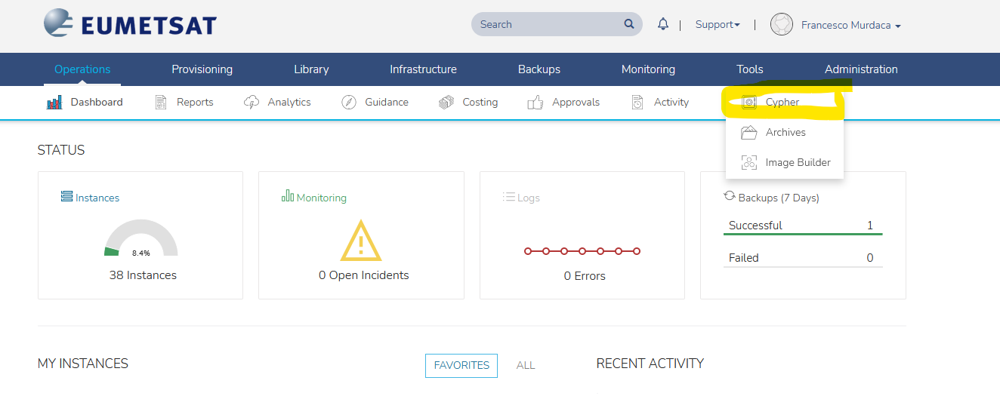

# How to manage IPA Server Credentials Within Morpheus

Upon intial setup, administration credentials (username and password) for your IPA server are stored as secrets in Morpheus Cypher. 

Note that EUMETSAT tenancies onboarded prior to October 2025 come with a pre-deployed Defaut Stack, and the secrets are stored under different names, specifically:

   - For EUMETSAT tenancies onboared prior to October 2025:
     - Admin Username: `secret/ipaadmin_username`
     - Password: `password/ipaadmin`
     - Domain Name: `secret/ldap_domain`
     - IPA Server Fully Qualified Domain Name: `secret/ldap_hostname`
     
   - For self-service deployments ([this very same template](../../README.md)): 
     - Admin Username: `secret/ipa_admin_username`
     - Password: `secret/ipa_admin_password`
     - Domain Name: `secret/ipa_domain`
     - IPA Server Hostname: `secret/ipa_server_hostname`

## Resources
- [How to Manage the IPA Server](./how-to-manage-the-ipa-server.md)
- [Morpheus Official Documentation](./https://docs.morpheusdata.com/en/7.0.9/tools/cypher.html)
