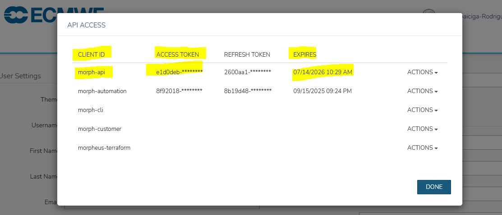
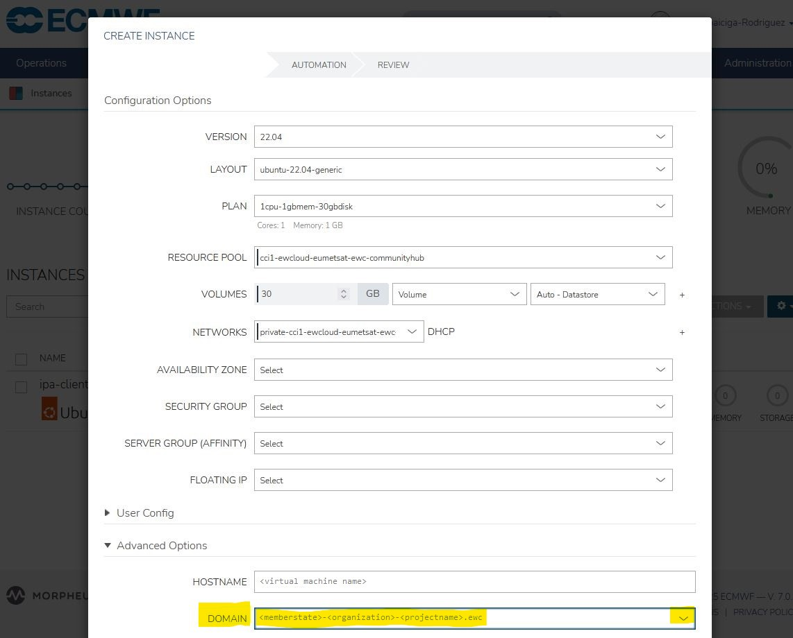

# Troubleshooting

When working with the default stack provisioning templates, you might encounter various issues. Here are some common problems and how to troubleshoot them:

## 1. Failed to authenticate against the Morpheus API

>💡 The `no_log: true` attribute, part of tasks this template, is set to prevent credentials from being logged upon execution failure.

In there is problem with Morpheus API authentication, you will get an error right at the point the runtime attempts to gather facts about Morpheus, similar to:
```
TASK [ipa-enroll-automation-via-morpheus : Gather facts about the Morpheus Tenant] **************************************************************************
fatal: [localhost]: FAILED! => {"censored": "the output has been hidden due to the fact that 'no_log: true' was specified for this result", "changed": false}
```

### Solution
Ensure the input value you set for `morpheus_api_token` is correct, the token has not expired and its client ID, as displayed in Morpheus UI's API Access tab, is `morph-api`:

 


## 2. VM provisioning completes without VM enrollment into IPA
This issue will most likely manifest when you first attempt to SSH into the VM with an LDAP user, and get access denied.

### Solution
Ensure you complete the [manual step](../README.md#2-manually-link-the-morpheus-workflow-to-the-user-defined-morpheus-domain) required to link the `IPA Client Enroll Automation Via Morpheus` Workflow to your user-defined domain name.

Likewise, when provisioning the VM via the Morpheus UI, make sure to select the correct option (your user-defined domain name) from the drop-down menu in the `AUTOMATION` > `Advanced Options` > `DOMAIN` section of the `CREATE INSTANCE` wizard:

 

## 3. VM fails to complete post-provisioning

This issue is typically triggered at the point your new VM, which the Morpheus Automation has configured to run the IPA Client, attempts to authenticate against the IPA server.

### Solution

Ensure the IPA administration information you set when running this template, and which are stored in Morpheus Cypher (details in [Outputs](../README.md#outputs) section) match the values used during the IPA Server configuration. If that is not the case, repeat the deployment steps of this template with updated input values.

If IPA administration information is not the culprit, ensure the IPA server is live reachable within the same private subnet as the VM that raised the error.